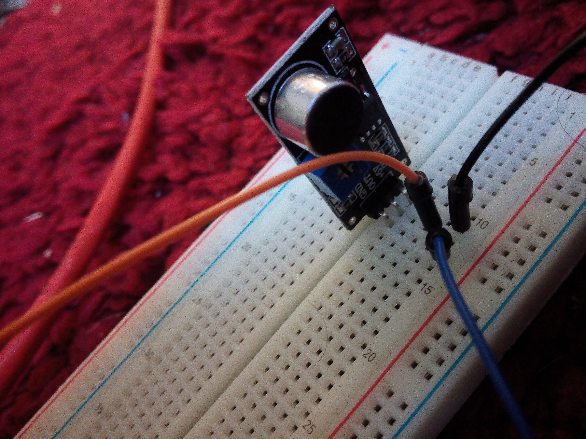

# IoT Raspberry pi - Arduino Uno connection via mqtr protocol

Internet of things project based on a sound sensor that gets the sound of a some noise in the arduino and creates an event that sends the client in the raspberryPi to open a web page browser in the server (in my case the laptop running the server)

IoT project in which an arduino with sound sensors will communicate the possible matches via serial library so the raspi can read the input and analise what kind of event we want to generate.

Example: One clap will display a web browser in the subscriber, two claps will set an alarm on the laptop.

The raspi running the publisher code will publish via mqtt protocol an event, depending on the event received in the subscriber, the laptop running the subscriber python code will execute the different tasks.

## Prerequesites

* Arduino Uno
* Sound sensor, in my case I used [this one](https://www.google.com/imgres?imgurl=https%3A%2F%2Fleantec.es%2Fwp-content%2Fuploads%2F2018%2F02%2Fp_2_1_7_0_2170-Detector-de-sonido-Chip-LM393-Modulo-Microfono-para-Arduino.jpg&imgrefurl=https%3A%2F%2Fleantec.es%2Ftienda%2Fdetector-de-sonido-chip-lm393-modulo-microfono-para-arduino%2F&docid=2j7GZDZtMvUZwM&tbnid=a5Pxw5mhb6JtUM%3A&vet=10ahUKEwjruLfIsYDmAhUSGewKHWwfAKsQMwi2ASgGMAY..i&w=1500&h=1500&safe=off&client=firefox-b-d&bih=813&biw=1400&q=lm393&ved=0ahUKEwjruLfIsYDmAhUSGewKHWwfAKsQMwi2ASgGMAY&iact=mrc&uact=8)

* Motherboard
* Raspberry Pi
* Computer with any operating system with Python installed so it can run the subscriber script

## Install

In the picture below you can see the connection of the sensor into the motherboard and it connected to the arduino

## Deployment

1-The arduino has to be connected to a clap senson in a motherboard in order the catch the sounds and transform them into an event that will process the raspberry into an event in the MQTT cloud. The arduino has to be connected to the raspberry via USB

2-Run the client in the raspberry that will connect to the MQTT cloud which will send all the information to the server (running in your laptop, for instance) which is already listening to the cloud. 

NOTE: run the server listening before the client sending!!

## Author

* **Álvaro Teruel Cañones** - *Initial work* - [alteruca](https://github.com/alteruca)
